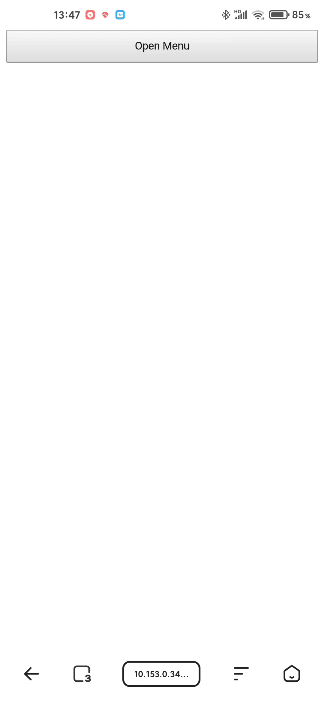

# return-action
In native apps, the return operation will undo the previous operation in some scenarios. For example:   
Click a button to open a dropdown panel, then return (use virtual return buttons or fullscreen gestures), the dropdown panel will close.  
But this only occurs in native apps, it will go back to the previous page in web page instead.  
Now this plugin will implement this functionality in web page.

## Preview


## Demo
https://eshengsky.github.io/return-action/example/

## Usage

### Install
```bash
$ npm install return-action
```

### Reference
```html
<script src="node_modules/return-action/dist/returnAction.js"></script>
```
also support module import:
```js
import returnAction from "return-action";
```

## Api
#### registerAction({actionName, pushActionHandler, popActionHandler})
Register an action.

`actionName`: The unique action name, string type.  
`pushActionHandler`: The action handler, function type.  
`popActionHandler`: The return action handler, function type.

#### pushAction(actionName)
Trigger the registered pushActionHandler.

#### popAction()
Trigger the last popActionHandler.

See [example](./example) for specific example.

## License
MIT License

Copyright (c) 2020 Sky.Sun 孙正华

Permission is hereby granted, free of charge, to any person obtaining a copy
of this software and associated documentation files (the "Software"), to deal
in the Software without restriction, including without limitation the rights
to use, copy, modify, merge, publish, distribute, sublicense, and/or sell
copies of the Software, and to permit persons to whom the Software is
furnished to do so, subject to the following conditions:

The above copyright notice and this permission notice shall be included in all
copies or substantial portions of the Software.

THE SOFTWARE IS PROVIDED "AS IS", WITHOUT WARRANTY OF ANY KIND, EXPRESS OR
IMPLIED, INCLUDING BUT NOT LIMITED TO THE WARRANTIES OF MERCHANTABILITY,
FITNESS FOR A PARTICULAR PURPOSE AND NONINFRINGEMENT. IN NO EVENT SHALL THE
AUTHORS OR COPYRIGHT HOLDERS BE LIABLE FOR ANY CLAIM, DAMAGES OR OTHER
LIABILITY, WHETHER IN AN ACTION OF CONTRACT, TORT OR OTHERWISE, ARISING FROM,
OUT OF OR IN CONNECTION WITH THE SOFTWARE OR THE USE OR OTHER DEALINGS IN THE
SOFTWARE.
